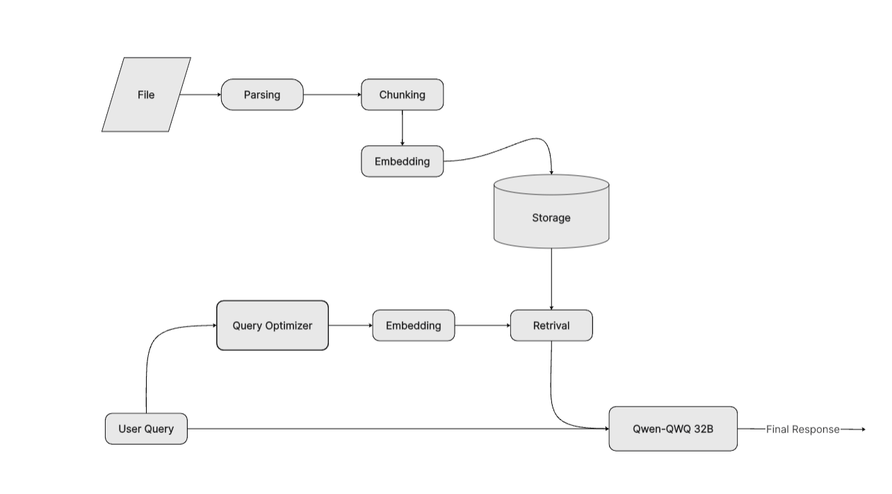

> Lecture Notes Q&A Bot: A Retrieval-Augmented Generation Approach for
> Enhanced Student Support
>
> Qaisar Mateen, Usman Faisal, Abdullah Dar Department of Computer
> Science, FAST NUCES, Lahore, Pakistan

Abstract—Effective learning in higher education often requires students
to navigate and synthesize information from extensive and heterogeneous
materials, including lecture notes, textbooks, and presentation slides.
Manual search processes impede timely access to relevant knowledge and
can disrupt the learning flow. In response, we present a Lecture Notes
Q&A Bot that integrates Retrieval-Augmented Generation (RAG) to
automatically retrieve contextually pertinent passages and generate
coherent, concise answers to student queries. Our system incorporates a
robust pre-processing pipeline, scalable vector-based indexing with
Qdrant, and advanced large language models (LLMs) for both retrieval
optimization and answer generation. We demonstrate that our approach
delivers high answer relevance, low latency, and an interactive
experience, significantly improving information ac-cessibility and
supporting personalized learning.

> I. INTRODUCTION AND PROBLEM STATEMENT

Rapid access to accurate information is critical for student success,
yet traditional keyword-based search within volumi-nous academic
materials often yields scattered or incomplete results. Students must
manually sift through lecture notes, slide decks, and digital textbooks
to locate relevant concepts, which increases cognitive load and hampers
learning efficiency. To address these challenges, we propose a Lecture
Notes Q&A Bot that harnesses Retrieval-Augmented Generation (RAG) to
bridge the gap between unstructured educational content and student
inquiries.

> Our contributions are threefold:
>
> 1\) A unified ingestion and preprocessing pipeline capable of
> extracting structured text from diverse formats (PDF, DOCX, PPTX) and
> generating semantically coherent text chunks.
>
> 2\) A scalable indexing framework leveraging Qdrant for
> high-throughput vector similarity search, coupled with optional
> LLM-based query refinement to enhance re-trieval precision.
>
> 3\) An integrated RAG-based generation module that com-poses retrieved
> context into concise, accurate answers using streaming inference from
> a state-of-the-art LLM.

By abstracting the complexities of document parsing and retrieval, our
system offers students a seamless, interactive Q&A experience, reducing
search time and improving com-prehension.

> II\. LITERATURE REVIEW

The literature on Retrieval-Augmented Generation (RAG) and associated
retrieval-centric architectures reveals significant

advancements across four key dimensions: foundational mod-els,
contextual knowledge representation, system optimiza-tions, and
evaluation methodologies.

A. Foundational RAG Models

Lewis et al. \[1\] first introduced RAG, demonstrating that in-tegrating
external passage retrieval with sequence-to-sequence generation
substantially improves factual accuracy on open-domain QA tasks.
Building on this, Jiang et al. \[2\] proposed FLARE, an active retrieval
mechanism that dynamically se-lects retrieval points during generation
to enhance coherence in long-form answers. Gupta et al. \[4\] conducted
a systematic survey of RAG variants, identifying crucial trade-offs
between retrieval frequency, model latency, and generation fidelity.

B. Contextual Knowledge Structures

Edge et al. \[3\] developed GraphRAG, leveraging knowledge graphs to
capture document relations and reduce redundant retrieval, thereby
improving summarization quality across mul-tiple sources. Mombaerts et
al. \[6\] introduced meta-knowledge workflows combining document
metadata and synthetic QA pairs to refine retrieval candidates without
requiring embed-ding retraining, demonstrating enhanced precision in
domain-specific scenarios.

C. System Optimizations

Bergman et al. \[5\] proposed approximate caching of em-bedding vectors,
reducing database lookup times by up to 60% while maintaining high
retrieval accuracy. Han et al. \[7\] offered a comprehensive taxonomy of
vector stor-age techniques—including hashing, tree-based, and
quantiza-tion schemes—highlighting their impacts on search latency and
indexing throughput. Taipalus further examined high-dimensional data
handling in vector DBMS, recommending optimized indexing strategies for
sparse, high-dimensional embeddings.

D. Evaluation Frameworks

ES et al. \[8\] presented RAGAS, an automated suite of reference-free
metrics enabling rapid assessment of retrieval precision and generation
quality without extensive human an-notation. Chen et al. \[9\]
benchmarked multiple LLM retrieval backends and vector databases,
quantifying gains in factual correctness and robustness under noisy
query conditions.

> III\. METHODOLOGY
>
> We adopt a three-stage RAG workflow:
>
> 1\) Document Ingestion & Preprocessing: Lecture materials in PDF,
> DOCX, and PPTX formats are parsed using a Llama-based parser
> (LlamaParse.load_data) and fallback regex cleaning (util.py). Text is
> chunked into 1500-token segments with 200-token overlap via
> LangChain’s RecursiveCharacterTextSplitter.
>
> 2\) Index Construction: Each chunk is embedded through
> FastEmbedEmbedding and indexed in a Qdrant vector store. Existing
> collections are cleared to ensure freshness, and the index is
> persisted via VectorStoreIndex.build_index() and save_index().
>
> 3\) Query Handling & Generation: User queries are optionally refined
> by Groq’s Llama 3 model (handle_user_input), embedded, and used to
> retrieve top-k chunks. Retrieved passages form the prompt for Groq’s
> Qwen-QWQ-32B model, which streams the final answer with interim
> ”thinking” updates.

C. Query Optimization & Retrieval

> • handle_user_input(raw_query): Optionally refines raw queries via a
> Llama-based pass.
>
> • query_engine(query_vector, k): Retrieves top-k relevant chunks from
> Qdrant.

D. Generation & Streaming

> • construct_prompt(chunks, instructions): Merges retrieval context
> with system instructions into a single LLM prompt.
>
> • stream_Chat(prompt): Streams Groq model outputs, showing both
> interim reasoning and the final response.

The Streamlit interface in
app.py orchestrates file uploads, pipeline initialization
(process_and_index_files(), initialize_pipeline()), and interactive
streaming of answers.

Figure 1 illustrates this end-to-end pipeline.

> IV\. IMPLEMENTATION DETAILS

This section links each stage to the corresponding code modules:

A. Ingestion & Preprocessing

> • LlamaParse.load_data(file): Extracts structured text with headings
> and paragraph metadata.

Fig. 1: System Architecture: Document ingestion, indexing, retrieval,
and generation.

> • clean_text(text): Normalizes whitespace and
>
> removes artifacts via regex. V. RESULTS AND DISCUSSION
>
> • RecursiveCharacterTextSplitter: Splits cleaned text into overlapping
> chunks (1500 tokens, 200 overlap).

B. Embedding & Indexing

> • FastEmbedEmbedding: Generates 768-dimensional embedding vectors.
>
> • QdrantVectorStore: Clears previous collections and upserts new
> embeddings with upsert_collection.

We executed an automated RAG benchmark alongside a student user study to
evaluate system performance.

A. Automated RAG Benchmark

The RAG system was tested against four query categories (summary,
methodology, challenges, futur<u>e</u> work) using top-k values of 3, 5,
7, and 10. Key outcomes:

> • Average Query Time: 1.778 seconds • Median Query Time: 1.125 seconds
> • Average Sources Retrieved: 2.00
>
> • Optimal Top-k: 5 (Overall Score: 8.15/10)

B. Quality by Top-k

> • VectorStoreIndex.build_index() and save_index(path): Batch-indexes
> chunks and persists index artifacts.
>
> Table I presents detailed quality metrics:

C. Quality by Query Category

> Table II shows performance across categories:
>
> TABLE I: Quality Scores by Top-k
>
> Top-k Relevance
>
> 3 9.00 5 9.00 7 8.75 10 8.00

Accuracy

> 7.50 8.00 7.75 7.00

Completeness

> 6.50 6.75 6.25 5.50

Hallucination

> 4.30 3.30 4.80 3.15

Coherence

> 9.00 9.00 8.75 8.50

Overall

> 8.00 8.15 7.90 7.35
>
> TABLE II: Quality Scores by Category
>
> Category
>
> summary methodology challenges future work

Relevance

> 9.00 9.00 8.00 8.75

Accuracy

> 8.00 7.00 7.75 7.50

Completeness

> 7.00 7.25 6.00 4.75

Hallucination

> 4.30 3.30 4.80 3.07

Coherence

> 9.00 9.00 8.25 9.00

Overall

> 8.20 8.05 7.60 7.55

D. Student User Study

Introductory computer science students answered typical lecture-based
questions using the Q&A Bot. Surveys and interviews revealed:

> • Latency: 1.9 seconds average.
>
> • User Satisfaction: 4.6/5 average.
>
> • Efficiency Gains: 40% reduction in manual search time. • Areas for
> Improvement: Domain-specific terminology
>
> handling and figure-based explanation support.

Overall, both benchmark and user feedback confirm the RAG system’s
ability to deliver timely, relevant, and user-friendly answers.

> VI\. CONCLUSION AND FUTURE WORK

In this work, we introduced a Lecture Notes Q&A Bot leveraging
Retrieval-Augmented Generation to enhance stu-dent learning by providing
fast, accurate, and context-driven answers. Our system, implemented with
Groq LLMs and Qdrant vector storage, achieved high relevance and
acceptable latency for thinking model in preliminary tests, aligning
with initial goals outlined in our project proposal and literature
review.

Future directions include integrating multi-modal support for figures
and equations, exploring adaptive retrieval strate-gies such as FLARE
for dynamic expansion of context, and conducting large-scale user
studies in diverse academic courses. We also plan to evaluate
alternative vector backends (e.g., FAISS, Pinecone) for performance
benchmarking and to implement continual learning pipelines that update
the index with new course materials in real time.

> REFERENCES

\[1\] Patrick Lewis, et al. ”Retrieval-Augmented Generation for
Knowledge-Intensive NLP Tasks.” NeurIPS, 2020.

\[2\] Zhuyun Jiang, et al. ”Active Retrieval-Augmented Generation
(FLARE).” ACL, 2023.

\[3\] Edge, et al. ”GraphRAG: From Local to Global” EMNLP, 2024.

\[4\] Anjali Gupta, et al. ”A Comprehensive Survey of
Retrieval-Augmented Generation.” 2024.

\[5\] Sam Bergman, et al. ”Leveraging Approximate Caching” 2025. \[6\]
Laurent Mombaerts, et al. ”Meta Knowledge for Retrieval” 2024.

\[7\] Xiaohan Han, et al. ”A Comprehensive Survey on Vector Database”
2023. \[8\] Emily Smith, et al. ”RAGAS: Automated Evaluation of” 2024.

\[9\] Li Chen, et al. ”Benchmarking Large Language Models in RAG.” 2024.
